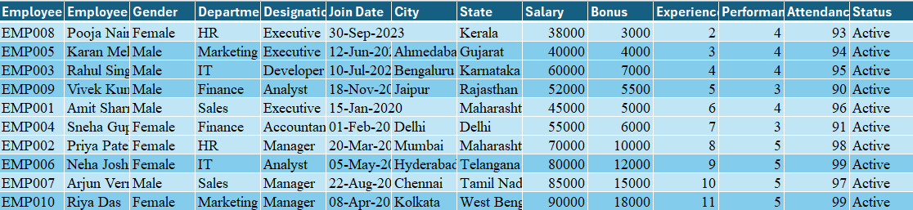
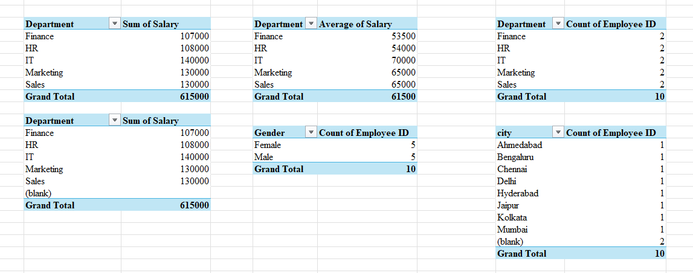
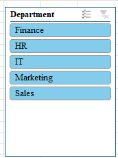
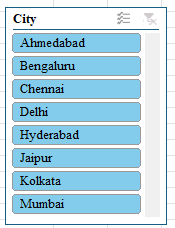
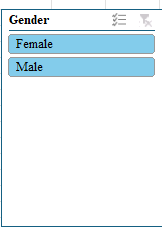
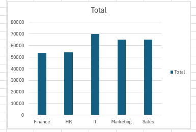

# Employee Data Analysis Using Excel

##  Project Overview

This project focuses on analyzing employee data using Microsoft Excel.

I used an employee dataset and performed different analysis tasks to find useful information from the data. I answered business-related questions using Excel formulas and also created Pivot Tables, a Bar Chart, and interactive Slicers.

##  Project Objective

The main objective of this project is to:

- Analyze employee data
- Find useful information from the dataset
- Answer different questions using Excel
- Summarize data using Pivot Tables
- Visualize data using a Bar Chart
- Use Slicers to filter and analyze data interactively

##  Tools & Features Used

- Microsoft Excel
- Excel Formulas
- Sorting and Filtering
- Pivot Tables
- Bar Chart
- Slicers
- Data Analysis

##  Dataset

The dataset contains employee-related information such as employee details, department, city, gender, and other employee attributes.

The dataset was used to perform different analysis questions and create summaries and visualizations.

##  Analysis Performed

In this project, I created questions based on the employee dataset and found their answers using Excel.

The analysis includes:

- Employee data analysis
- Question-based analysis
- Data filtering
- Pivot Table analysis
- Department-wise analysis
- City-wise analysis
- Gender-wise analysis
- Chart-based visualization

##  Pivot Table

I created Pivot Tables to summarize the employee data and make the analysis easier to understand.

Pivot Tables were used to organize and summarize the data based on different categories.

##  Bar Chart

A Bar Chart was created to visually represent the analyzed employee data.

Charts make it easier to compare values and understand patterns in the data.

##  Interactive Slicers

I added three Slicers to make the Excel analysis interactive:

- **Department Slicer** – Filter data based on department
- **City Slicer** – Filter data based on city
- **Gender Slicer** – Filter data based on gender

These Slicers allow the user to interactively filter the data and view the analysis based on selected categories.

##  Project Screenshots

## Employee table 

### Pivot Table

### Department Slicer

### City Slicer

### Gender Slicer

### Bar Chart

##  Project Files

- `Employee_data_analysis.xlsx` – Complete Excel analysis file
- `Screenshots/` – Screenshots of the analysis, Pivot Table, Slicers, and Bar Chart

##  Key Learning

Through this project, I learned how to:

- Work with employee datasets in Excel
- Analyze data using Excel
- Answer questions from a dataset
- Use Pivot Tables for data summarization
- Create charts for data visualization
- Use Slicers for interactive data filtering
- Present data analysis in a clear and understandable way

##  Conclusion

This project helped me understand how Excel can be used for real-world data analysis. It also improved my practical knowledge of data analysis, summarization, and visualization.

This project is part of my learning journey toward becoming a **Data Analyst**.
